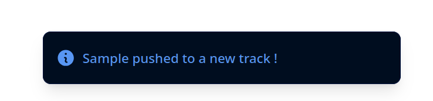

# Jamcraft

See [REPORT.md](/docs/REPORT.md) or [slides.pdf](/docs/slides.pdf)

## Introduction
Jamcraft a web audio mixing tool that allow multiple users to create small musics collaboratively. All users cursors and timeline interactions are visible in realtime. This is kinda like a very simplified GarageBand but collaborative! There is no existing music collection, but you all users can upload their samples so everyone can use it in the main project.


## Development setup
### Requirements
- Docker
- Java
- FFmpeg (on MacOS `brew install ffmpeg`, otherwise see [download page](https://www.ffmpeg.org/download.html)), this should include the `ffprobe` CLI used to extract the audio duration on upload.

### Setup
**Clone or get the project**
```sh
git clone git@github.com:amt-classroom/amtb-lab3-amtb-ouadahi-roland-strcksn-vanhove.git
cd amtb-lab3-amtb-ouadahi-roland-strcksn-vanhove
```

**Run the Envoy proxy**

We have an issue with the proxy, each developer has to locally change the `envoy.yaml` to include the Docker internal host IP.

How to find this special IP ?
- On Windows: `ipconfig -all` -> Find the HyperV IP
- On MacOS and Linux: `ip a` -> find the `docker0` IP

Change the given IP at the end of `envoy.yaml` with the one you just found.
```yml
    address:
    socket_address:
        address: 172.17.0.1
        port_value: 9000
```

On MacOS and Linux, this command
```sh
docker run -p 8081:8080 -p 9091:9091 -v ./envoy.yaml:/etc/envoy/envoy.yaml envoyproxy/envoy:v1.17.0
```
On Windows, Powershell requires `\`
```sh
docker run -p 8081:8080 -p 9091:9091 -v .\envoy.yaml:/etc/envoy/envoy.yaml envoyproxy/envoy:v1.17.0
```

**Start the quarkus dev server**

Using the Quarkus CLI
```sh
quarkus dev
```

If you want to try this with multiple computers, you need to run the quarkus dev server by exposing the port in the network. In your `application.properties`, you have to add this:
```
quarkus.http.host=0.0.0.0
```

Using the Gradle wrapper otherwise
```sh
./gradlew quarkusDev
```

**Database**  
Under `src/main/resources/import.sql`, we defined a few queries you can use to have a few fake data. The SQL is commented by default so you can try the project with an empty database. If you enable this SQL, you need to add the associated audio files in `audio`.

**Open your browser on `localhost:8080`**

You should see the UI loaded with a login form, an empty library and no track, that's normal.

Login form


Empty UI


You can take a few audios file in MP3 formats (note for teachers and assistants: take the zip we gave you). You can find way more public domain sounds on `freesound.org` in case you want to try it more.

See usage on how to learn how to use it.

## Usage
1. **Login**: choose a username for the session, this will be persisted locally to support page refresh
1. **Upload new samples**
    1. Try to drag and drop a MP3 file
    1. You can also automate the upload with this Fish function (if you use Fish)
    ```fish
    function jamcraft_upload
        for i in $argv
            echo "Uploading $i"
            curl -s -X POST -F name=(string sub -e 25 (string split __ $i)[2]) -F file=@$i localhost:8080/samples | jq
            echo ""
        end
    end
    ```
    1. You can find uploaded files in the `audio` folder at repository's root
1. **Try to play** and see the waveforms of samples in the library on the left
    
1. Add new tracks by drag and dropping samples from the library to the dedicated zone at bottom right. You should see a notification, but the project doesn't reload, that's expected.
    
1. Load the project timeline by pressing **twice** on `Load project`. You should now see the track with the dragged sample.
    
1. Add more samples and reload the project
1. Try to press **Play** and **Pause**
1. **Shortcuts**: pressing `h` or `l` should go one second before or after. Pressing space should press the play/pause button. Pressing `0` should go at start and `$` at end. These movements are obviously inspired by Vim.
1. Try to open another browser (not a private window), go on `localhost:8080` too, choose another username, you should see the flying mouse on the first browser.
1. Try to move a sample on a track, it should move on the other browser in live.

## Unimplemented features
1. As we finally used Wavesurfer, we had to give up the idea of having tracks that can contain multiple samples, so we ended up having just one track per sample in database.
1. Remove a sample is not possible
1. The "nice to have" export feature
1. Logout - only possible manually in the browser console via `localStorage.clear() `
1. Production build and deployment with Docker and Docker Compose

