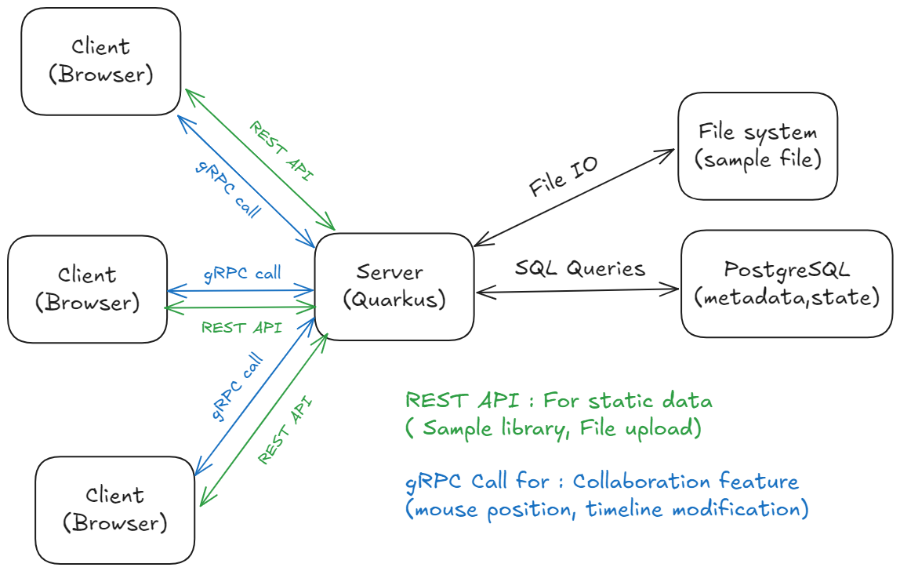
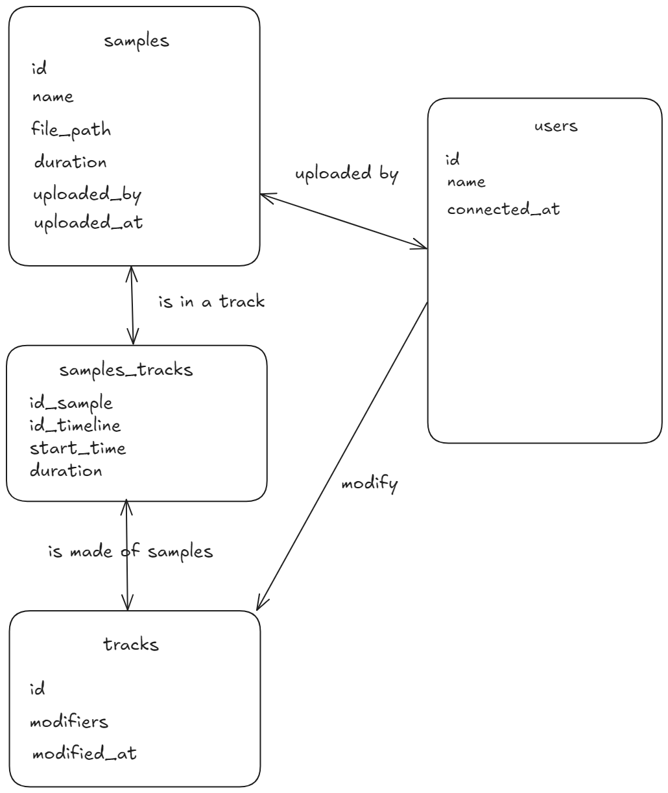

# **JamCraft**

**Authors:** Yanis Ouadahi, Samuel Roland, Jarod Streckeisen, Timothée Van Hove

JamCraft is a collaborative web app where multiple users can create music together by mixing and editing sound samples. If you know GarageBand, think of JamCraft as its collaborative cousin, but simplified and designed to work seamlessly in a browser. Users can contribute their own sound samples, manipulate tracks on a shared timeline, and see live updates from others. It's all about making music together in real time.

## **Description of the Application**

JamCraft is built to push the boundaries of real-time collaboration using gRPC technology. Its core concept revolves around enabling users to upload sound samples into a global library, arrange them on stacked timelines, and edit them with basic tools. All interactions happen in real-time, ensuring users see updates and actions from others instantly.

The application focuses on responsiveness. Users can interact with stacked tracks, making edits such as trimming, moving, or deleting samples. Each user's cursor is tracked and displayed, offering intuitive collaboration. JamCraft is designed for a single shared session, making it easy for all users to jump in, pick a name, and start creating music together.

### **Technology Stack**

- **Backend:** Built with Quarkus and written in Java 21. It uses gRPC for real-time communication and PostgreSQL as the relational database.
- **Frontend:** A modern, web-based interface built using gRPC-web.
- **Database:** PostgreSQL is used to manage metadata (user data, sample details, timeline configuration), while the actual samples are stored in the server filesystem.
- **Deployment:** The backend is containerized using **Docker** for consistent and portable deployment.

### **Why gRPC?**

gRPC is designed for fast communication and offers advanced bidirectional streaming, which fits perfectly with the collaborative nature of JamCraft. Unlike traditional HTTP/REST, gRPC uses Protobuf for communication, which are lightweight and fast. This allows us to handle real-time updates, cursor tracking, and global timeline editing with minimal delay.

Here’s what we’ll explore with gRPC:

- **Bidirectional Streaming:** Both clients and the server will continuously send and receive updates, making collaboration instant.
- **Concurrent Streams:** Multiple users will connect simultaneously, testing how gRPC handles the load.
- **High Throughput:** We’ll push thousands of operations per second to measure latency and see how far we can go.
- **Protobuf Flexibility:** As we evolve our features, we’ll test how easy it is to add fields without breaking existing functionality.
- **Security:** We'll implement encryption (TLS/SSL) and explore token-based authentication for user sessions.

## **Features**

### **User Stories**

1. As a user, I want to upload sound samples to a global library so that everyone can use them.
2. As a user, I want to browse the global library to find samples to add to the project.
3. As a user, I want to arrange sound samples on shared timelines so that I can create music with others.
4. As a user, I want to cut and edit sound samples on the timeline so that I can make fine adjustments.
5. As a user, I want to see other users’ mouse cursors moving in real time so that I know who’s doing what.
6. As a user, I want to join a shared session after choosing my username so that I can contribute.
7. As a user, I want to delete or move samples on the timeline so that I can adjust the arrangement.
8. As a user, I want the application to save the project state so that I don’t lose my work if I disconnect.

### **Application Features**

 The main feature is the shared timeline, where everyone sees the same project and can make changes in real time. Each user’s mouse cursor is tracked and displayed, making collaboration more intuitive. There will also be basic editing tools for trimming and splitting samples.

The application is designed for one shared session where everyone connects together. This keeps it simple while focusing on the real-time aspect of collaboration. Users choose a name before joining, making the session personal and easy to identify who’s working on what.

### **Nice to Haves**

If time permits, we’d like to add features like user-specific permissions (e.g., locking tracks so only some users can edit them), advanced editing tools like fade-in/out, and the ability to save multiple sessions or projects. Another cool feature could be live audio chat, but that’s a stretch goal.

## **Architecture**

JamCraft follows a three-tier architecture:

Real-Time Playback: Samples are played simultaneously on the frontend using the Web Audio API, synchronized via gRPC. This ensures low-latency playback while offloading audio processing to the client.

File Storage: Samples are stored on the filesystem, with metadata pointing to their locations. This avoids database bloat and improves performance.

Messaging: We may use JMS for notifications or asynchronous tasks, such as processing large audio files.

### Diagrams

#### Architecture

#### Modelisation

