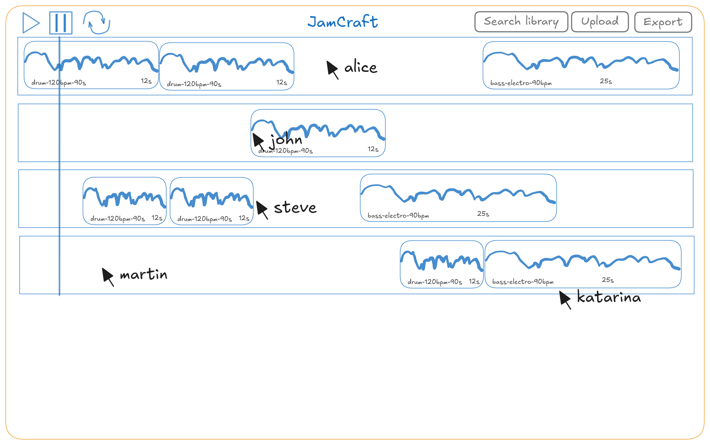

# JamCraft

**Authors:** Yanis Ouadahi, Samuel Roland, Jarod Streckeisen, Timothée Van Hove

JamCraft is a collaborative web app where users can unleash their creativity by mixing and editing sound samples in real time. Think of it as a playful, collaborative cousin of GarageBand, but without the pressure of perfection. It’s a sandbox for sound—a place to have fun, experiment with music, and jam together with friends or strangers online.

Here how could look like the main page

5 users are participating, everyone see the mouse of others, the timeline is divided in tracks on which users can put samples at any starting point.

It's possible to play, pause, play in loop, search the library or upload a new sample. At the end, the timeline could be exported.

## **Purpose and Business Domain**

The purpose of JamCraft is simple: make music creation fun, interactive, and collaborative. While professional tools focus on precision and polish, JamCraft is all about creativity and the joy of collaboration. We’re targeting anyone who loves playing with sound. Whether you want to experiment, share a laugh with friends while creating silly beats, or just spend an afternoon exploring what’s possible with samples, JamCraft is here for you. The business domain centers around casual, accessible music creation. Unlike complex music software, JamCraft doesn’t require prior knowledge of music theory or sound design. It’s a virtual playground where everyone can contribute their idea.

## **Description of the Application**

JamCraft combines sound samples, collaborative editing, and real-time interaction into a single shared environment. Here’s the gist: users upload or choose samples from a global library, arrange them on shared tracks, and edit them together. Everything happens live, so when one user moves a sample or adds a beat, everyone else sees it instantly.

The application focuses on responsiveness. Users can interact with stacked tracks, making edits such as trimming, moving, or deleting samples. Each user's cursor is tracked and displayed, offering intuitive collaboration. JamCraft is designed for a single shared session, making it easy for all users to jump in, pick a name, and start creating music together.

### **Technology Stack**

- **Backend:** Built with Quarkus and written in Java 21. It uses gRPC for real-time communication and PostgreSQL as the relational database.
- **Frontend:** A React SPA hosted on the same domain, the integration of both tools on the same port is possible [Quarkus Quinoa](https://docs.quarkiverse.io/quarkus-quinoa/dev/advanced-guides.html). We'll use [TailwindCSS](https://tailwindcss.com/) to design the page and TypeScript to simplify development and grpc schema changes. The frontend will use [gRPC-web](https://github.com/grpc/grpc-web) to access the available Grpc services.
- **Database:** PostgreSQL is used to manage metadata (user data, sample details, tracks content), while the actual samples are stored in the server filesystem.
- **Deployment:** The backend is containerized using Docker for consistent and portable deployment.
- **Audio processing**: the final export will probably be generated in the backend to access libraries such as ffmpeg. Playing multiple audios in the browser seems to be possible with the Audio API, we probably won't need a "mixing into a single file" phase to be able to play modifications.

### **Why gRPC?**

gRPC is designed for fast communication and offers advanced bidirectional streaming, which fits perfectly with the collaborative nature of JamCraft. Unlike traditional HTTP/REST, gRPC uses Protobuf for communication, which are lightweight and fast. This allows us to handle real-time updates, cursor tracking, and global timeline editing with minimal delay.

Here’s what we’ll explore with gRPC:

- Bidirectional Streaming: Real-time collaboration is all about instant feedback. With gRPC, changes like moving a sample or editing a track are streamed directly to all connected clients.
- Protobuf Flexibility: As we add features, we’ll test how easy it is to add fields and being backward compatible with older clients.
- Concurrent Streams: Multiple users will connect simultaneously, testing how gRPC handles the load.
- High Throughput: We’ll push thousands of operations per second to measure latency and see how far we can go.
- Security: We'll try support encryption (TLS/SSL)

## **Features**

### **User Stories**

1. As a user, I want to upload my own sound samples to a global library so that others can use them.
2. As a user, I want to browse and search the global library to find samples to add to my tracks.
3. As a user, I want to arrange sound samples on shared tracks to create collaborative music.
4. As a user, I want to trim, cut, and move sound samples so that I can customize the arrangement.
5. As a user, I want to see other users’ mouse cursors in real time so that I know who’s interacting with what.
6. As a user, I want to join the session and choose a username so others know who I am.
7. As a user, I want to delete or modify samples on any track so that I can fix mistakes.
8. As a user, I want to be able to close my browser tab and reopen to continue, without loosing the modifications so the project doesn't depend on my internet connectivity.

### Core Features

* A shared repository where users can upload and browse sound samples. Preloaded samples make it easy to get started.
* Tracks are shared, and updates are synchronized live using gRPC.
* Users can move, trim, and delete samples to refine their tracks.
* See everyone’s cursor in real time to enhance collaboration.
* Playful Simplicity: JamCraft is a sandbox, not a studio. It’s about fun, not perfection.

### **Nice to Haves**

If time allows, we’d love to explore:

- Advanced editing tools like fade-ins, effects, or reverse playback.
- User-specific permissions (e.g., locking a track).
- Support for multiple sessions and the ability to export finished projects.
- Live chat.

## **Architecture**

JamCraft follows a three-tier architecture:

Real-Time Playback: Samples are played simultaneously on the frontend using the Web Audio API. This ensures low-latency playback while offloading audio processing to the client. The modifications of tracks are synchronized via gRPC.

File Storage: Samples are stored on the filesystem, with metadata pointing to their locations. This avoids database bloat and improves performance.

Messaging: We may use JMS for notifications or asynchronous tasks, such as processing large audio files.

### Diagrams

#### Architecture

The main page is the React SPA, loaded on `/`, the next interactions made by the SPA are made towards the REST API or the gRPC calls. Samples can be downloaded by clients when needed.

#### Data model

We don't have accounts and login system, we just have users identified by a random ID and a name, without any permission system.
